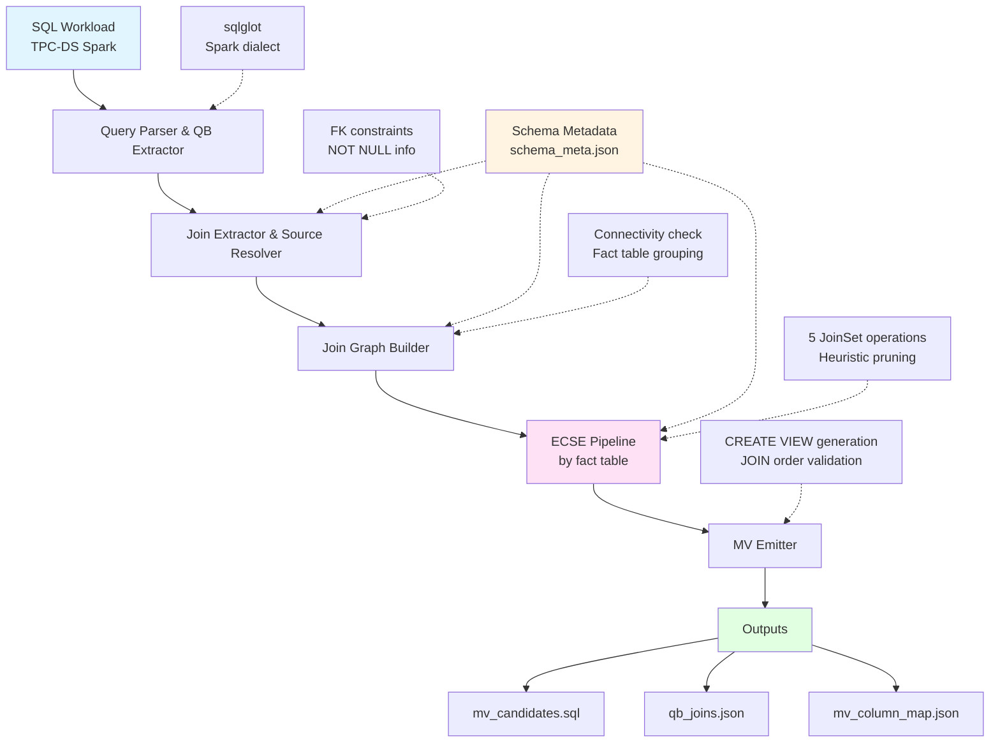
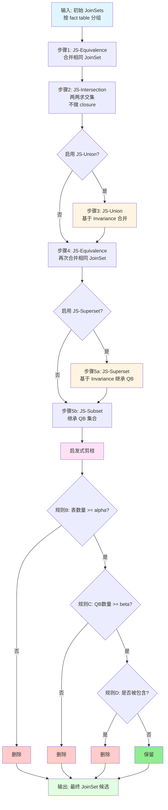
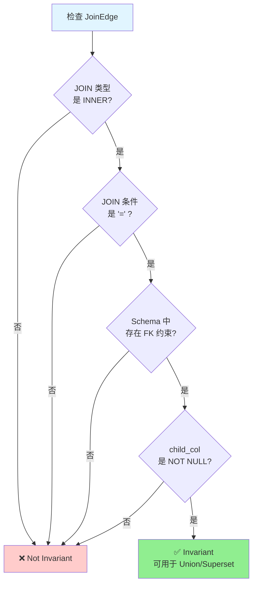
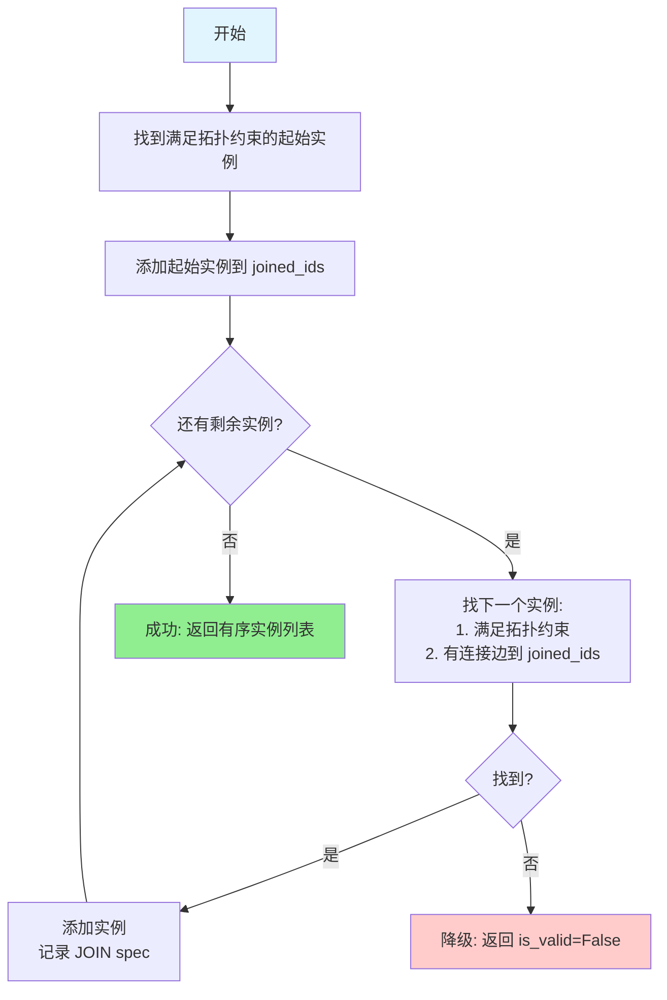

# ECSE: Extended Candidate Selection Engine

基于工作负载的物化视图候选自动生成系统

## 项目简介

ECSE (Extended Candidate Selection Engine) 是一个用于从 SQL 工作负载中自动生成物化视图候选的系统。本项目基于论文 *"Automated generation of materialized views in Oracle"* (Ahmed et al., 2020) 实现，使用 Python + sqlglot 对 TPC-DS Spark SQL workload 进行分析，自动生成优化的物化视图候选。

### 核心功能

- **QueryBlock (QB) 提取**：从复杂 SQL 中提取查询块，支持 CTE、UNION、子查询
- **Join 图构建**：自动识别表连接关系，区分 INNER/LEFT JOIN，支持显式和隐式 JOIN
- **TableInstance 语义保留**：支持同一表的多实例别名（如 `date_dim d1, date_dim d2, date_dim d3`）
- **ECSE 算法**：实现论文中的五种 JoinSet 操作（Equivalence、Intersection、Union、Superset、Subset）
- **Invariance 分析**：基于外键约束和 NOT NULL 约束进行语义不变性判定
- **启发式剪枝**：通过多种规则减少候选数量，提高质量
- **MV 生成**：输出语义正确的 CREATE VIEW 语句，保证 JOIN 顺序正确性与别名语义

## 系统架构



## 环境要求

- Python 3.9+
- Conda (推荐使用 `ecse` 环境)

### 主要依赖

- `sqlglot`: SQL 解析与转换
- `pytest`: 单元测试框架

## 安装

```bash
# 克隆仓库
git clone https://github.com/Lianghan-Zhang/ecse_test.git
cd ecse_test

# 创建 conda 环境
conda create -n ecse python=3.9
conda activate ecse

# 安装依赖
pip install sqlglot pytest
```

## 使用方法

### 1. 运行主程序

```bash
# 方式一：激活环境后直接运行
conda activate ecse
python ecse_main.py

# 方式二：使用 conda run（无需激活环境）
conda run -n ecse python ecse_main.py
```

### 2. 使用 CLI 工具（可配置参数）

```bash
# 查看帮助
python -m ecse_gen.cli --help

# 运行示例
python -m ecse_gen.cli \
  --workload_dir tpcds-spark/ \
  --schema_meta schema_meta.json \
  --out_dir output/ \
  --dialect spark \
  --alpha 2 \
  --beta 2 \
  --enable_union 1 \
  --enable_superset 1
```

### 3. 调试工具

```bash
# 查看 SQL 的 AST 结构
python -m ecse_gen.debug_ast \
  --sql_file tpcds-spark/q01.sql \
  --schema_meta schema_meta.json

# 或直接传入 SQL 语句
python -m ecse_gen.debug_ast \
  --sql "SELECT * FROM store_sales JOIN item ON ss_item_sk = i_item_sk" \
  --schema_meta schema_meta.json
```

## 输出说明

### 1. `mv_candidates.sql`

包含所有生成的物化视图定义：

```sql
-- mv_001
-- fact: store_sales
-- qbset: [q17.sql::qb::main:0::root, q42.sql::qb::union_branch:1::root.union]
-- edges: store_sales.ss_item_sk=item.i_item_sk (INNER); ...
CREATE VIEW mv_001 AS
SELECT
  item.i_brand,
  item.i_brand_id,
  SUM(store_sales.ss_ext_sales_price) AS ext_price
FROM store_sales
JOIN item ON store_sales.ss_item_sk = item.i_item_sk
GROUP BY item.i_brand, item.i_brand_id
;
```

### 2. `qb_joins.json`

每个 QueryBlock 的详细信息：

```json
{
  "qb_id": "q01.sql::qb::main:0::root",
  "source_sql_file": "q01.sql",
  "qb_kind": "main",
  "sources": [...],
  "join_edges": [...],
  "mv_candidates": ["mv_001", "mv_014"],
  "ecse_eligible": true
}
```

### 3. `mv_column_map.json`

列映射关系，用于查询重写：

```json
{
  "mv_001": {
    "group_by_columns": {
      "item.i_brand": "i_brand",
      "item.i_brand_id": "i_brand_id"
    },
    "aggregate_columns": {
      "SUM(store_sales.ss_ext_sales_price)": "ext_price"
    }
  }
}
```

## 配置参数

在 `ecse_main.py` 中可以修改以下配置：

```python
CONFIG = {
    "schema_meta": "schema_meta.json",    # Schema 元数据 (完整 TPC-DS 25 tables)
    "workload_dir": "tpcds-spark/",       # SQL workload 目录
    "out_dir": "output/",                 # 输出目录
    "dialect": "spark",                   # SQL 方言
    "alpha": 2,          # 最小表数量阈值（剪枝）
    "beta": 2,           # 最小 QB 数量阈值（剪枝）
    "enable_union": True,      # 启用 JS-Union 操作
    "enable_superset": True,   # 启用 JS-Superset 操作
}
```

## 测试

```bash
# 运行所有测试
pytest tests/

# 运行特定测试
pytest tests/test_join_extractor.py
pytest tests/test_ecse_ops.py

# 详细输出
pytest -v tests/
```

### 测试覆盖

当前共有 **270 个测试用例**全部通过。

- ✅ Schema 元数据加载
- ✅ Workload 读取与预处理
- ✅ QueryBlock 提取（CTE、UNION、子查询）
- ✅ Join 边抽取（INNER/LEFT JOIN、USING、WHERE 隐式）
- ✅ Join 图连通性检查
- ✅ ECSE 五种操作
- ✅ Invariance 判定
- ✅ 启发式剪枝
- ✅ MV SQL 生成
- ✅ 列引用实例重映射 (P0-4)
- ✅ 混合 JOIN 连接感知排序 (P0-5)

## 项目结构

```
ecse_test/
├── ecse_gen/               # 核心模块
│   ├── schema_meta.py      # Schema 元数据加载
│   ├── workload_reader.py  # Workload 读取与预处理
│   ├── qb_extractor.py     # QueryBlock 提取
│   ├── qb_sources.py       # 数据源解析
│   ├── join_extractor.py   # Join 边抽取
│   ├── join_graph.py       # Join 图构建
│   ├── invariance.py       # Invariance 分析
│   ├── ecse_ops.py         # ECSE 核心算法
│   ├── heuristics.py       # 启发式剪枝
│   ├── mv_emitter.py       # MV SQL 生成
│   ├── output_writer.py    # 输出文件写入
│   ├── cli.py              # 命令行接口
│   └── debug_ast.py        # AST 调试工具
├── tests/                  # 单元测试
├── tpcds-spark/            # TPC-DS Spark SQL 查询
├── output/                 # 输出目录
├── ecse_main.py            # 主入口
├── schema_meta.json        # 完整 TPC-DS schema (25 tables, with FK constraints)
├── design.md               # 详细设计文档
├── CLAUDE.md               # 项目规则
└── README.md               # 本文件
```

## 技术栈

- **SQL 解析**: [sqlglot](https://github.com/tobymao/sqlglot) - 支持多种 SQL 方言的解析器
- **测试框架**: [pytest](https://pytest.org/) - Python 单元测试
- **数据结构**: Python dataclasses - 轻量级数据类
- **Schema 元数据**: JSON 格式 - 包含表结构、外键、约束信息

## 核心算法

### ECSE JoinSet 操作（按顺序执行）



1. **JS-Equivalence**: 合并相同 JoinSet 的 QB 集合
2. **JS-Intersection**: 两两 JoinSet 求交集（不做 closure）
3. **JS-Union**: 基于 Invariance 合并 JoinSet
4. **JS-Equivalence**: 再次合并相同 JoinSet
5. **JS-Superset/Subset**: 继承 QB 集合关系

### Invariance 判定

满足以下条件时认为 JOIN 是 invariant：

- JOIN 类型为 INNER
- JOIN 条件为等值连接（`=`）
- 存在外键约束：child_table.child_col → parent_table.parent_col
- child_col 列为 NOT NULL



### 启发式剪枝

- **规则 B**: JoinSet 表数量 < alpha → 删除（默认 alpha=2）
- **规则 C**: QB 集合大小 < beta → 删除（默认 beta=2）
- **规则 D**: Maximal 检查 - 删除被其他 JoinSet 完全包含的候选

## 聚合函数支持

MV Emitter 支持提取以下聚合函数：

| 函数类型 | sqlglot 表达式 | 示例 |
|---------|---------------|------|
| 计数 | `COUNT`, `COUNT(*)` | `COUNT(ss.ss_quantity)` |
| 求和 | `SUM` | `SUM(ss.ss_ext_sales_price)` |
| 平均 | `AVG` | `AVG(ss.ss_quantity)` |
| 最值 | `MIN`, `MAX` | `MIN(cd.cd_dep_count)` |
| 标准差 | `STDDEV`, `STDDEV_POP`, `STDDEV_SAMP` | `STDDEV_SAMP(ss.ss_quantity)` |
| 方差 | `VARIANCE`, `VARIANCE_POP` | `VARIANCE(inv.inv_quantity)` |

### 聚合别名策略

- **直接别名继承**：当聚合是 `Alias` 的直接子节点时继承原别名
- **复杂表达式处理**：`sum(a)/sum(b) AS ratio` 中的聚合不继承外层别名
- **多 QB 合并冲突**：同一聚合在不同 QB 使用不同别名时，自动生成中立别名
- **自动生成格式**：`{func}_{table}__{column}`（如 `sum_ss__ss_net_profit`）

## 已知限制

- 当前仅支持 `join_only` 模式，不包含 GROUP BY/聚合推理
- 不支持 OR 条件、复杂表达式中的 JOIN
- CTE/Derived Table 的 JOIN 默认不参与 ECSE（可配置）
- 未实现成本/收益评估（论文后续模块）

## 关键设计：TableInstance 语义保留

### 问题背景

在复杂 SQL 查询中，同一个表可能以不同别名出现多次。例如 TPC-DS 中常见的模式：

```sql
SELECT ...
FROM store_sales
JOIN date_dim d1 ON ss_sold_date_sk = d1.d_date_sk
JOIN date_dim d2 ON ss_returned_date_sk = d2.d_date_sk
JOIN date_dim d3 ON ss_ship_date_sk = d3.d_date_sk
```

如果简单地使用表名作为标识符，会丢失别名语义，导致无法正确区分 `d1`, `d2`, `d3`。

### 解决方案：TableInstance

引入 `TableInstance` 数据结构，同时保存：
- `instance_id`：表实例的别名（如 `d1`, `d2`, `d3`）
- `base_table`：基础表名（如 `date_dim`）

```python
@dataclass(frozen=True)
class TableInstance:
    instance_id: str   # 别名，用于 SQL 输出和图顶点标识
    base_table: str    # 基表名，用于 schema 验证和 FK 检查
```

### 对核心模块的影响

1. **CanonicalEdgeKey**：使用 `left_instance_id` + `left_base_table` 代替单一的 `left_table`
2. **ECSEJoinSet**：使用 `instances: frozenset[TableInstance]` 代替 `tables: frozenset[str]`
3. **JoinGraph**：顶点使用 `TableInstance`，连通性检查使用 `instance_id`
4. **MV 生成**：正确输出带别名的 JOIN 语句，如 `JOIN date_dim AS d1`

### 生成的 MV 示例

```sql
CREATE VIEW mv_001 AS
SELECT ...
FROM catalog_sales
INNER JOIN date_dim AS d3
    ON d3.d_date_sk = catalog_sales.cs_sold_date_sk
INNER JOIN store_returns
    ON store_returns.sr_customer_sk = catalog_sales.cs_bill_customer_sk
INNER JOIN date_dim AS d2
    ON d2.d_date_sk = store_returns.sr_returned_date_sk
INNER JOIN store_sales
    ON store_sales.ss_ticket_number = store_returns.sr_ticket_number
INNER JOIN date_dim AS d1
    ON d1.d_date_sk = store_sales.ss_sold_date_sk
...
```

## 实例映射与 JOIN 排序增强

### 列引用实例重映射 (P0-4)

当 JoinSet 合并后，不同 QB 可能使用不同的 instance_id 引用同一基表：

```
QB1: SELECT i.i_brand FROM item i      → ColumnRef(instance_id='i', column='i_brand')
QB2: SELECT item.i_brand FROM item     → ColumnRef(instance_id='item', column='i_brand')
```

`remap_columns_to_joinset()` 函数自动重映射列引用：

- **单实例基表**：可安全重映射（如 `item` → `i`）
- **多实例基表**：不可重映射，触发降级（避免猜测）
- **无法匹配**：列被过滤，记录 warning

### 混合 JOIN 连接感知排序 (P0-5)

对于包含 LEFT JOIN 的 JoinSet，`_build_mixed_join_plan()` 使用贪婪连接感知排序：

1. **拓扑约束**：LEFT JOIN 的 preserved side 必须先于 nullable side
2. **连接约束**：实例必须有连接边到已加入的实例才能添加
3. **降级策略**：断开的图或冲突约束导致 MV 降级，而非生成无效 SQL



## 未来扩展

- [ ] 实现 `paper_like` 模式（包含聚合推理）
- [ ] 添加查询重写模块
- [ ] 支持多 fact table 场景（snowstorm）
- [ ] 集成成本模型与候选选择
- [ ] 支持 PostgreSQL、MySQL 等其他方言

## 参考文献

Ahmed, R., et al. (2020). "Automated generation of materialized views in Oracle." *Proceedings of the VLDB Endowment*, 13(12), 3046-3058.

## 许可证

本项目仅供学习和研究使用。

## 贡献

欢迎提交 Issue 和 Pull Request！

## 联系方式

- GitHub: [Lianghan-Zhang/ecse_test](https://github.com/Lianghan-Zhang/ecse_test)
